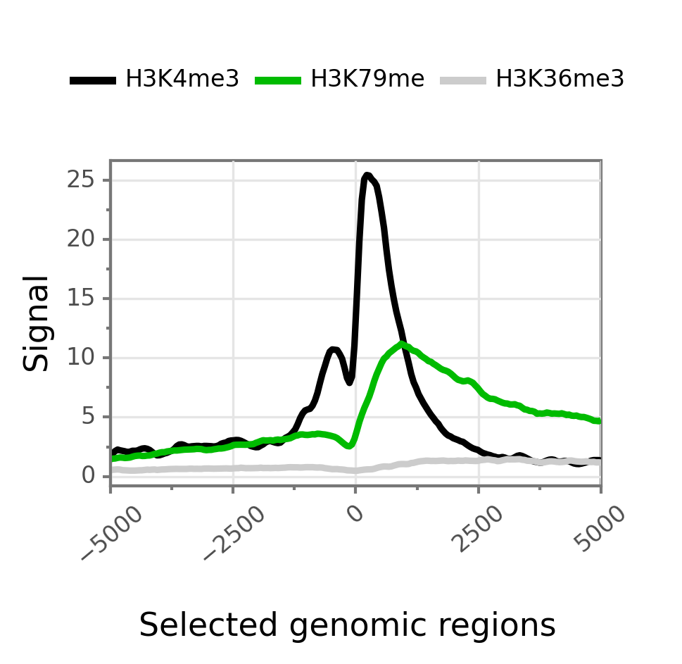
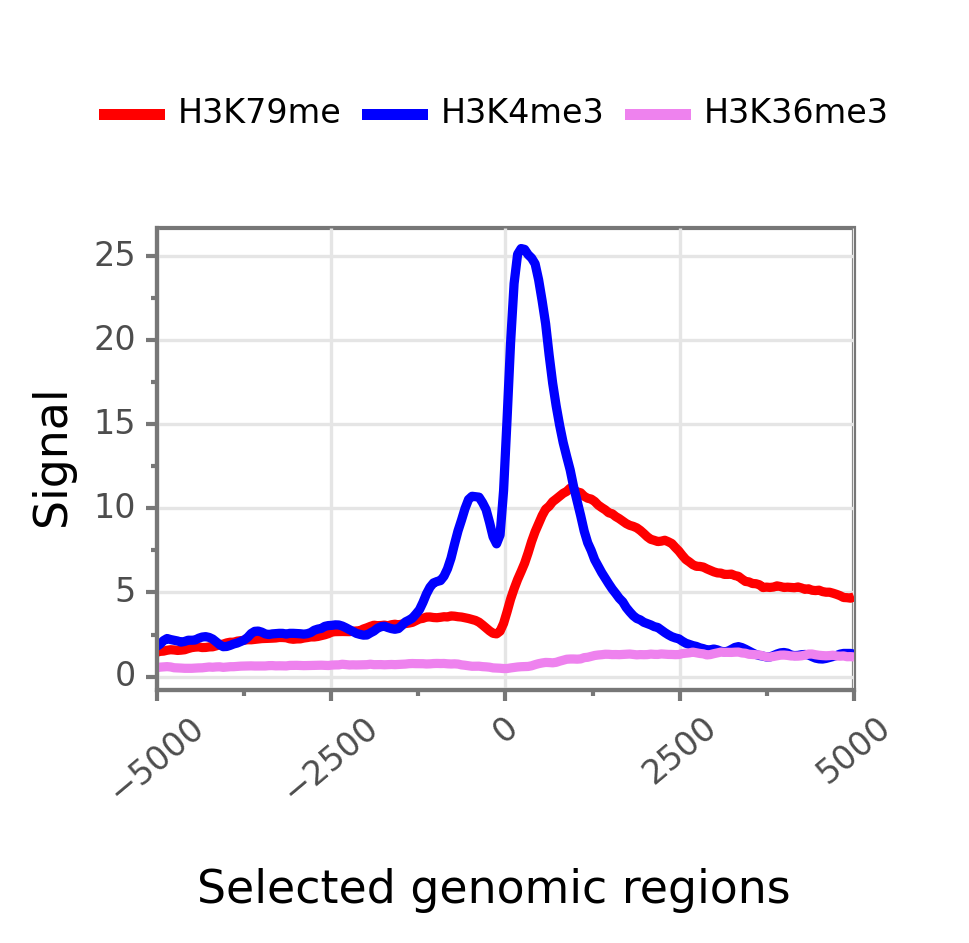
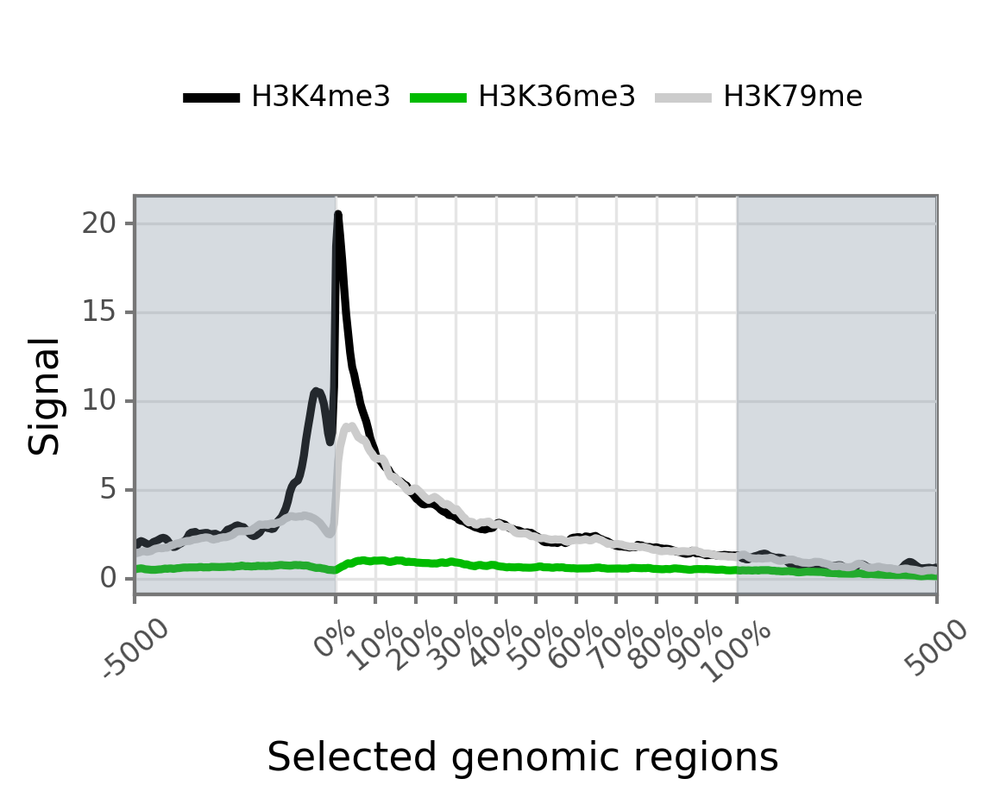
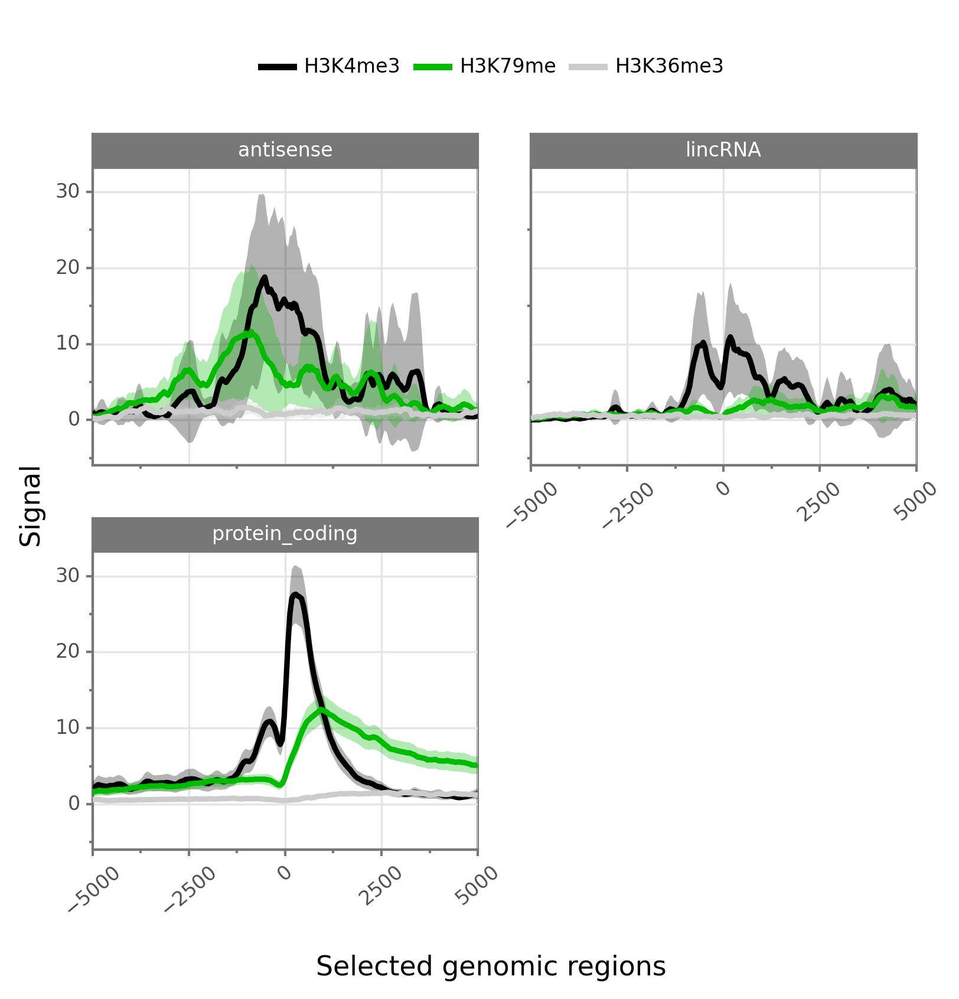
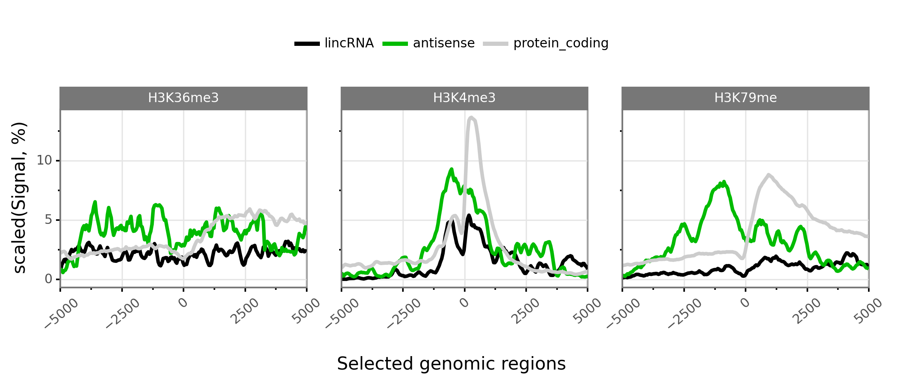
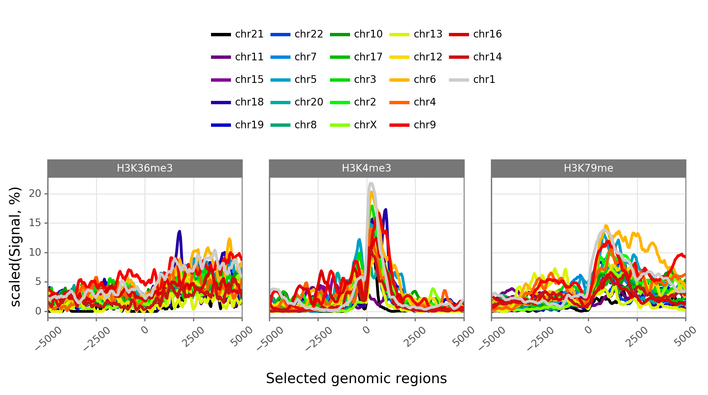
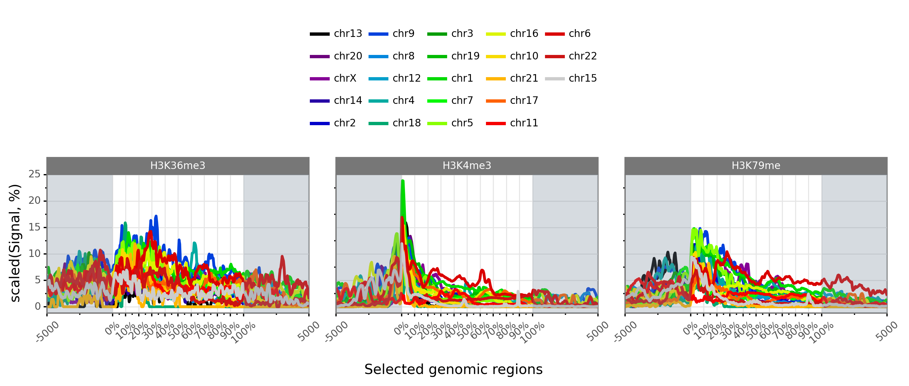

Commands from section 'coverage'
----------------------------------

coverage
~~~~~~~~

**Description:** Takes a GTF as input to compute bigwig coverage in regions of interest (promoter, transcript body, intron, intron_by_tx, tts...) or a BED6 to focus on user-defined regions. If --n-highest is used the program will compute the coverage of each bigwig based on the average value of the n windows (--nb-window) with the highest coverage values.
Regions were signal can be computed (if GTF file as input) are promoter, tts, introns, intergenic regions or any feature available in the GTF file (transcript, exon, gene...).
If --matrix-out is selected, the signal for each bigwig will be provided in a dedicated column. Otherwise, signal for each bigwig is provided through a dedicated line.

 **Example:**

We will first request a lightweight example dataset (but more realistic than the 'simple' dataset).

.. command-output:: gtftk get_example -d mini_real_noov_rnd_tx -f '*'
	:shell:

.. command-output:: gtftk get_example -d mini_real -f '*'
	:shell:

Now we will compute coverage of promoters regions using 3 bigWig files as input.

.. command-output:: gtftk coverage -l H3K4me3,H3K79me2,H3K36me3 -u 5000 -d 5000 -i mini_real_noov_rnd_tx.gtf.gz -c hg38.genome -m transcript_id,gene_name -x ENCFF742FDS_H3K4me3_K562_sub.bw ENCFF947DVY_H3K79me2_K562_sub.bw ENCFF431HAA_H3K36me3_K562_sub.bw -k 4 > coverage.bed
	:shell:

Now we can have a look at the result:

.. command-output:: head -n 10 coverage.bed
	:shell:

**Arguments:**

.. command-output::  gtftk coverage -h
	:shell:

------------------------------------------------------------------------------------------------------------------

mk_matrix
~~~~~~~~~~

Description: Gtftk implements commands that can be used to produce coverage profiles around genomic features or inside user-defined regions. A coverage matrix need first to  be produced from a bwig using the mk_matrix command.

**Example:**

We will used the same dataset (mini_real.gtf) as produced above (see help on *coverage* command).

We can now create a coverage matrix around TSS/TTS or along the full transcript
(with or without 5' and 3' regions). Provide a BED file as *---inputfile* if you
want to use your own, user-specific, regions.
Will will create tree example datasets:

First we will create a coverage matrix around promoter based on a subset of randomly choose transcripts (one per gene) from the 'mini_real' dataset (see section on the *coverage* command to get info about the construction of the *mini_real_noov_rnd_tx.gtf.gz* dataset).

.. command-output::  gtftk get_example -f '*' -d mini_real
	:shell:

.. command-output::  gtftk get_example -f '*' -d mini_real_noov_rnd_tx
	:shell:

.. command-output:: gtftk mk_matrix -k 5 -i mini_real_noov_rnd_tx.gtf.gz -d 5000 -u 5000 -w 200 -c hg38.genome  -l  H3K4me3,H3K79me,H3K36me3 ENCFF742FDS_H3K4me3_K562_sub.bw ENCFF947DVY_H3K79me2_K562_sub.bw ENCFF431HAA_H3K36me3_K562_sub.bw -o mini_real_promoter
	:shell:

The following command compute coverage profil along the whole transcript.

.. command-output:: gtftk mk_matrix -k 5 --bin-around-frac 0.5 -i mini_real_noov_rnd_tx.gtf.gz -t transcript  -d 5000 -u 5000 -w 200 -c hg38.genome  -l  H3K4me3,H3K79me,H3K36me3 ENCFF742FDS_H3K4me3_K562_sub.bw ENCFF947DVY_H3K79me2_K562_sub.bw ENCFF431HAA_H3K36me3_K562_sub.bw -o mini_real_tx
	:shell:

.. command-output:: gtftk mk_matrix -h
	:shell:

------------------------------------------------------------------------------------------------------------------

profile
~~~~~~~

Description: This command is used to create profil diagrams from a *mk_matrix* output. The two important arguments for
this command are *---group-by*, that defines the variable controling the set of colored lines and *---facet-var* that defines the variable controling the way the plot is facetted . Both *---group-by* and *---facet-var* should be set to one of *bwig*, *tx_classes* or *chrom*.

**Basic profiles**

A simple overlayed profile of all epigenetic marks around promoter. Here *---group-by* is, by default set to *bwig* and *---facet-var* is set to None. Thus a single plot with several lines corresponding to bwig coverage is obtained.

.. command-output:: gtftk profile -D -i mini_real_promoter.zip -o profile_prom -pf png -if  example_01.png
	:shell:

Changing colors and applying color order can be done using the following syntax:

.. command-output:: gtftk profile -D -i mini_real_promoter.zip -c 'red,blue,violet' -d H3K79me,H3K4me3,H3K36me3 -o profile_prom -pf png -if  example_01b.png
	:shell:

Transcript coverage is obtained using the *mini_real_tx.zip* matrix. This provides a simple overlayed profile of all epigenetic marks along the transcript body extended in 5' and 3' regions:

.. command-output:: gtftk profile -D -i mini_real_tx.zip -o profile_tx -pf png -if  example_02.png
	:shell:

**Faceted profiles**

Faceted plot of epigenetic profiles. The groups (i.e colors/lines) can be set to bwig classes and the facets to transcript classes. Things can be simply done by providing an additional file containing the transcript and their associated classes.

**Example:**

.. command-output:: gtftk profile -D -i mini_real_promoter.zip -f tx_classes -g bwig  -t tx_classes.txt -o profile_prom  -pf png -if  example_05.png -e -V 2 -fc 2
	:shell:

Alternatively, the groups can be set to chromosomes or transcript classes:

.. command-output:: gtftk profile -D -i mini_real_promoter.zip -g tx_classes -f bwig  -t tx_classes.txt -o profile_prom  -pf png -if  example_06.png -V 2 -nm ranging
	:shell:

.. command-output:: gtftk profile -D -i mini_real_promoter.zip -g chrom -f bwig  -t tx_classes.txt -o profile_prom  -pf png -if  example_06b.png -V 2 -nm ranging
	:shell:

Note that facets may also be associated to epigenetic marks. In this case each the --group-by can be set to *tx_classes* or *chrom*.

.. command-output:: gtftk profile -D -i mini_real_tx.zip -g tx_classes -t tx_classes.txt -f bwig  -o profile_tx -pf png -if  example_07.png -w -nm ranging
	:shell:

.. image:: _static/example_07.png
    :width: 75%
    :target: _static/example_07.png

.. command-output:: gtftk profile -D -i mini_real_tx.zip -g chrom -f bwig  -o profile_tx -pf png -if  example_08.png  -w -nm ranging
	:shell:

.. command-output:: gtftk profile -h
	:shell:

