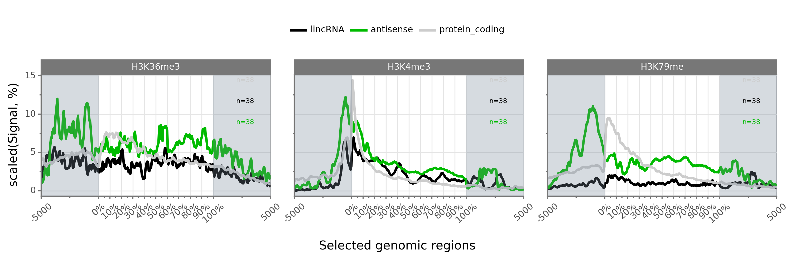

Welcome to pygtftk documentation page
--------------------------------------

The **Python GTF toolkit (pygtftk) package** is intented to ease handling of GTF/GFF2.0 files (Gene Transfer Format). It currently does not support GFF3 file format. The pygtftk package is compatible with Python >=3.5,<3.7 and relies on **libgtftk**, a library of functions **written in C**.

The package comes with a set of **UNIX commands** that can be accessed through the **gtftk main Unix program**. The gtftk program exposes several subcommands than can be piped, for instance, to filter, convert, extract or delete data from GTF files. The gtftk set of Unix commands, can be easily extended using a basic plugin architecture. All these aspects are covered in the help section.

While the gtftk Unix program comes with hundreds of unitary and functional tests, it is still upon  active development thus feel free to post any problem or required enhancement through the github interface.

Table of content
----------------

.. toctree::
    :maxdepth: 2

    about
    installation
    gtftk_args
    information
    editing
    selection
    convertion
    annotation
    coordinates
    sequence
    coverage
    miscellaneous
    api
    bwig_coverage
    developers

