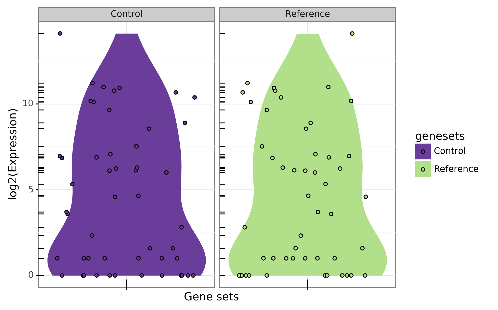

Commands from section 'miscellaneous'
-------------------------------------

control_list
~~~~~~~~~~~~~~~~~~~~~

**Description:** Returns a list of gene matched for expression based on reference values. Based on a reference gene list (or more generally IDs) this command tries to extract a set of other genes/IDs matched for signal/expression. The --reference-gene-file contains the list of reference IDs while the --inputfile contains a tuple gene/signal for all genes.

**Example:**

.. command-output:: gtftk control_list -i mini_real_counts_ENCFF630HEX.tsv -r mini_real_control_1.txt -D -V 2 -s -l -p 1 -ju -if example_13.png -pf png
	:shell:

**Arguments:**

.. command-output:: gtftk control_list -h
	:shell:

col_from_tab
~~~~~~~~~~~~~~~~~~~~~~

**Description:** Select columns from a tabulated file based on their names.

**Example:**

.. command-output:: gtftk get_example | gtftk select_by_key -t | gtftk tabulate -k '*' -x | gtftk col_from_tab -c transcript_id,gene_id
	:shell:

**Arguments:**

.. command-output:: gtftk col_from_tab -h
	:shell: